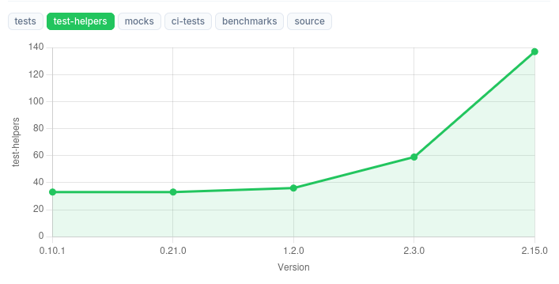

# Explorando Práticas de Teste

Neste exercício, vamos explorar práticas de teste em sistemas reais utilizando a ferramenta [TestMiner](https://andrehora.github.io/testminer).

O TestMiner permite visualizar e analisar testes de software em repositórios do GitHub, fornecendo dados sobre como os projetos organizam seus testes, como eles evoluem entre versões e quais bibliotecas de teste são utilizadas.
Explore a ferramenta antes de começar para se familiarizar com seu funcionamento.

---

## Passo 1: Selecionar um repositório

Escolha um repositório real que possua testes escritos na linguagem de sua preferência.
Abaixo estão alguns links para ajudá-lo a encontrar projetos interessantes:

- **Python:** https://github.com/topics/python?l=python
- **JavaScript:** https://github.com/topics/javascript?l=javascript
- **TypeScript:** https://github.com/topics/typescript?l=typescript
- **Java:** https://github.com/topics/java?l=java

## Passo 2: Explorar o repositório selecionado

Busque o repositório escolhido no [TestMiner](https://andrehora.github.io/testminer) e analise os dados de teste gerados pela ferramenta.

## Passo 3: Explicar uma prática de teste

Com base nos dados obtidos, selecione uma prática ou dado de teste relevante e explique-o com suas próprias palavras.

---

## Instruções de entrega

1. Faça um `fork` deste repositório (saiba mais sobre forks [aqui](https://docs.github.com/pt/pull-requests/collaborating-with-pull-requests/working-with-forks/fork-a-repo)).
2. Responda às questões abaixo diretamente neste arquivo `README.md` do seu fork. Pode adicionar imagens para enriquecer sua explicação.
3. No Moodle, submeta apenas a URL do seu fork.

---

## Respostas

**1. Repositório selecionado:** [Scrapy](https://github.com/scrapy/scrapy) 

**2. Explicação:** Nos dados do Scrapy analisados pelo TestMiner, destaca-se a prática de construção de um ecossistema de testes totalmente autocontido, evidenciada pela ausência de dependências externas específicas para testes. Isso indica uma escolha arquitetural intencional do projeto de não depender de bibliotecas de terceiros para simulação, configuração ou execução dos testes, mantendo controle total sobre seu ambiente de validação. Essa abordagem reduz riscos de incompatibilidade, falhas decorrentes de atualizações externas e a complexidade de manutenção, além de garantir maior previsibilidade na execução dos testes ao longo do tempo; por outro lado, implica um aumento no esforço interno, refletido na maior quantidade de testes e helpers necessários para sustentar essa estratégia.

Comprovando essa decisão, observa-se a presença de uma grande quantidade de test helpers, que atuam como a base interna desse ecossistema. Conforme ilustrado no gráfico de evolução do TestMiner a seguir, o projeto já inicia com um número elevado de cerca de 33 helpers, apresentando crescimento contínuo ao longo das versões, fazendo com que ultrapasse uma centena de helpers. Esses helpers encapsulam comportamentos complexos, como simulação de ambientes assíncronos, configurações e utilidades reutilizáveis, substituindo, na prática, o papel de ferramentas externas. Dessa forma, a imagem evidencia que, à medida que o Scrapy evolui, ele fortalece sua própria infraestrutura de testes em vez de introduzir novas dependências, consolidando um modelo cada vez mais autônomo e consistente.

